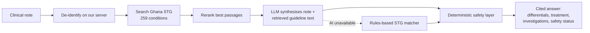

# MedPal - AI clinical decision support for Ghana

**PAAIS Hack-AI-Thon 2026 submission - Haydeen Technologies**

MedPal helps nurses, physician assistants and doctors in Ghanaian health facilities decide what to do next. A clinician types a clinical note. MedPal returns ranked differential diagnoses, treatment guidance, investigations and safety flags. Every answer is grounded in and cited to the **Ghana Standard Treatment Guidelines (STG, 7th Edition)**.

- **Live product:** https://medpal.ghehrhealth.com
- **Status:** in production since June 2026; in clinical use at a Ghanaian clinic through GhEHR, our electronic health record
- **Demo access for judges:** see the submission form (credentials are not published here)

> MedPal is decision support with the clinician in charge. It does not diagnose autonomously and it does not give advice to patients.

## Why this repository contains no source code

MedPal is a live product used in clinical care, so its production codebase is private. This repository documents what we built, how it works and how we test it, so judges can assess the work. **A full code walkthrough is available to judges on request.**

## The problem

Ghana's challenge is not only the number of clinicians but their distribution. In 2018 the Ghana Health Service had 47,758 unfilled posts, a 41% gap against its own minimum staffing norms, and its best-staffed region was 2.17 times better staffed than its worst ([Asamani et al., Hum Resour Health, 2021](https://link.springer.com/article/10.1186/s12960-021-00590-3)). In the rural north, staff take on tasks above their level of training and beyond their job descriptions, often without training first ([Okyere et al., PLOS ONE, 2017](https://journals.plos.org/plosone/article?id=10.1371%2Fjournal.pone.0174631)). Health-centre staff describe phoning the district hospital when unsure how to manage a case ([Bawontuo et al., BMC Family Practice, 2021](https://pmc.ncbi.nlm.nih.gov/articles/PMC7866672/)), and Ghanaian physician assistants find clinical decision-making harder to acquire than practical skills ([Niyogi et al., Afr J Emerg Med, 2015](https://www.sciencedirect.com/science/article/pii/S2211419X15000282)).

Ghana already has national Standard Treatment Guidelines. The gap MedPal addresses is turning them into patient-specific support at the point of care, when senior expertise is not on site.

## How it works

| Step | What happens | AI or rules? |
|---|---|---|
| De-identification | Patient names and ID numbers are replaced on our own server before any text leaves it | Local model (OpenMed), runs on our server |
| Retrieval | Semantic + keyword search over the Ghana STG, then a cross-encoder reranks the best passages | Local models |
| Synthesis | An LLM combines the note with the retrieved guideline text into a differential and STG-grounded management suggestions, with citations | **AI** (Claude Haiku 4.5 on Amazon Bedrock; swappable) |
| Safety | Emergencies are forced to "Emergency: refer now"; contraindications, pregnancy, paediatric dosing and missing-vitals checks run on every answer | **Rules**, not AI |
| Citations | A citation is shown only if it came from the retrieved guideline text | Rules |
| Fallback | If the AI is disabled or unreachable, a rules-based STG matcher still answers, with citations | Rules |

More detail: [docs/ARCHITECTURE.md](docs/ARCHITECTURE.md)

## Where AI creates value, and where it is not allowed to decide

The AI does the part that is slow to do by hand: combining a free-text presentation with the retrieved guideline into a differential and guideline-grounded management suggestions. The clinician decides. The parts where a mistake could harm a patient are enforced in code: privacy, emergency escalation and citation integrity. See [docs/SAFETY_AND_EVALUATION.md](docs/SAFETY_AND_EVALUATION.md).

## Validation status

MedPal has **engineering validation** today (50 Ghanaian test vignettes re-run on every release, about 95 automated tests, deterministic safety rules, de-identification tests). It is **not yet clinically validated**. Next: independent clinician review, STG concordance, unsafe-recommendation rate, emergency referral sensitivity, then a prospective pilot. See [docs/SAFETY_AND_EVALUATION.md](docs/SAFETY_AND_EVALUATION.md).

**We are seeking clinical facilities and clinical or research partners for this evaluation.**

## Two ways to use it

1. **Inside GhEHR** - our offline-first electronic health record for Ghanaian facilities calls the MedPal API server to server. Each facility chooses full AI analysis or a guideline-only mode that sends no patient text to any AI. If MedPal is unreachable, GhEHR falls back to local processing and the clinician is never blocked.
2. **Standalone web app** - individual clinicians register, analyse notes, search the guideline and pay by Mobile Money or card.

## Business model

| Plan | GHS / month | AI analyses / month |
|---|---|---|
| Free | 0 | 3, then guideline-only |
| Solo clinician | 99 | 300 |
| Practice | 399 | 1,500 |
| Enterprise | 1,499 | 6,000 |

Each AI analysis costs about GHS 0.11 in model usage, giving a 56-67% gross margin even if every quota is fully used. Details: [docs/BUSINESS_MODEL.md](docs/BUSINESS_MODEL.md)

## Tech stack

FastAPI (Python 3.11), PostgreSQL, Redis, ChromaDB, `all-MiniLM-L6-v2` embeddings, `ms-marco-MiniLM` cross-encoder, Amazon Bedrock (Claude Haiku 4.5), OpenMed de-identification, React + TypeScript + MUI frontend, Paystack (Mobile Money) and Stripe billing, Docker + Caddy on AWS, GitLab CI with test, smoke-test and auto-rollback deployment.

## API shape

See [examples/](examples/) for a request and response. All endpoints are under `/v1` with Bearer-key auth: `POST /v1/analyze`, `POST /v1/copilot/chat` (streaming), `GET /v1/guidelines/search`.

## Team

- **Mohammad Deen Hayatu** - Founder and CEO, Haydeen Technologies. PhD candidate in human genetics (Universitätsklinikum Erlangen). Built MedPal and GhEHR.
- **Osmanu Amadu** - Statistics and business (MSc Statistics; BSc Mathematics with Economics).
- **Etaaf Sutura Usman** - UX/UI design.
- **Clinical advisor** - recruiting: a clinical advisory and validation partner to lead MedPal's clinical evaluation.

## Contact

Haydeen Technologies, Effiduasi, Ghana. See the submission form for contact details.

---
Copyright 2026 Haydeen Technologies. Documentation shared for hackathon judging. All rights reserved.
